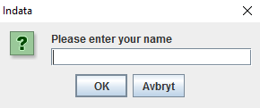
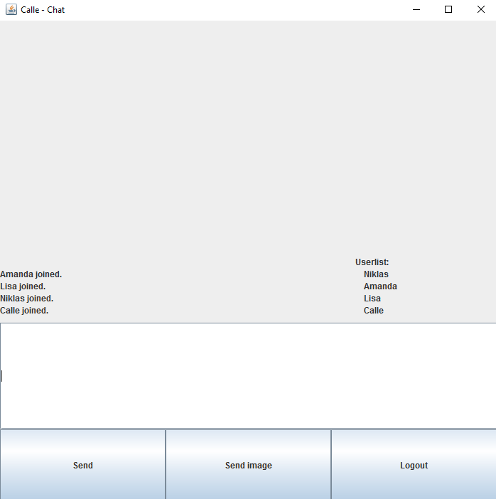
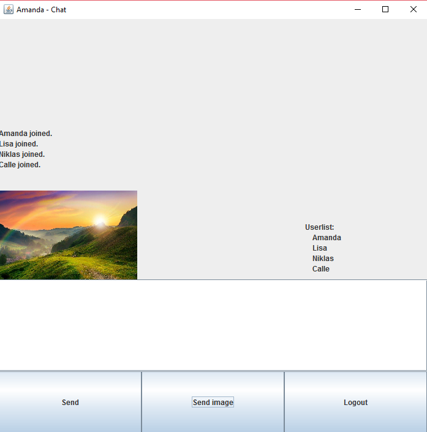

# EDA095 projekt - Chattforum 

Lisa Silfversten, Amanda Eliasson, Carl Johan Balck, Niklas Ovnell

## Resultat
I vårt projekt har vi utvecklat ett chattforum, där det går att skicka både textmeddelanden i en gruppchatt till samtliga användare (broadcast) och privata meddelanden till en sprecifik användare. Förutom att skicka textmeddelanden kan användare även skicka bilder. Chattforumet innehåller en användarlista där alla inloggade användare syns, det vill säga användare läggs till i användarlistan när de loggar in och tas bort från användarlistan när de loggar ut. När Användare loggar in väljer de ett användarnamn och när de vill logga ut klickar de ner chatten. Användare har även möjlighet att ändra gränsnittets storlek.

## Tekniker och design
I projektet används en multitrådar TCP server och TCP klienter. Det finns även ett program som kör mutipla trådar och som läser och visar meddelanden.

## Utvärdering
Arbetet och resultatet blev som förväntat och vi lyckades åstadkomma det vi ville. Eventuella framtida implementeringar hade varit att använda en HTTP server istället för en TCP server och använda en databas för att spara användare. Designen av forumet och fler funktionaliteter är även något som vi hade lagt till i ett framtida system. 

Ett råd till personer som vill utveckla liknande projekt är att från början bygga upp systemet med en HTTP server, då det är både svårt och kostar mycket tid att ändra, när man kommit en bit i projektet (vi kom på det försent och fick därför hoppa över det). 
